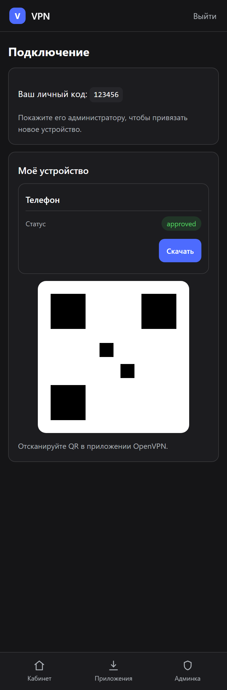
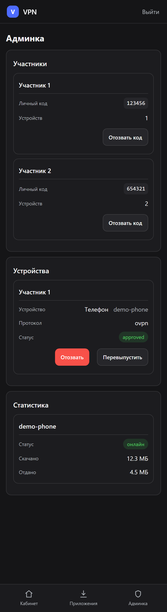
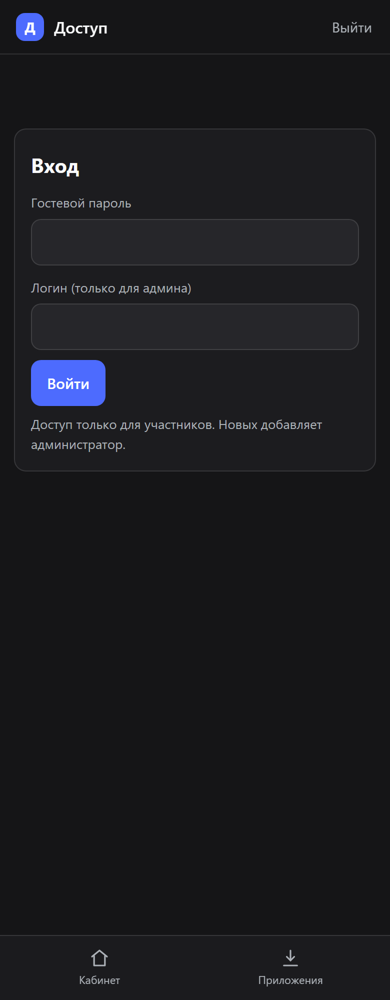

# GUI-панель выдачи VPN-доступа

Веб-панель поверх AntiZapret: администратор создаёт профиль одним нажатием, участник сканирует QR и подключается. Тёмная мобильная тема, нижняя навигация, крупные тап-зоны.

## Экран участника

Ровно две вещи: QR-код для подключения и ссылка на профиль.



*QR на скриншоте - декоративная картинка, не сканируется. В самой панели QR рабочий и ведёт на профиль устройства.*

## Админка

Список устройств (одобрить / отозвать / QR / удалить) и добавление участника одной формой.



*Скриншоты сняты с реальной вёрстки, данные обезличены.*

## Вход

Отдельно гостевой пароль (для участников) и логин администратора.



## Возможности

- Админ: «Добавить участника» - устройство создаётся и одобряется сразу, ключ генерируется тут же, открывается QR.
- Участник: вход по гостевому паролю, личный код, экран с QR и ссылкой на профиль.
- Профили OpenVPN: логин/пароль, inline `ca` + `tls-crypt`, отдача по секретной ссылке `/p/<token>` (доступна без пароля - её сканирует телефон).
- QR профиля ведёт на короткую ссылку: сам профиль ~2 КБ и в QR не помещается читаемо.
- Админ: **статистика** - кто онлайн и сколько трафика потребил (сборщик раз в минуту, накопительно).
- Админ: **смена логина и пароля** прямо в панели, с подтверждением текущего пароля.
- Опционально: VLESS (Xray) и AmneziaWG, если они есть на сервере.
- Всё состояние в SQLite, никаких внешних БД.

## Первый вход

| Кто | Логин | Пароль |
|---|---|---|
| Администратор | `admin` | `admin` |
| Гость | - | `VDS_GUEST_PASS` |

**Смените пароль администратора сразу** - `VDS_ADMIN_PASS` в `/etc/vds-panel.env`.

## Установка

```bash
./deploy/install-gui.sh
```

Панель слушает `127.0.0.1:8010`. Наружу - через nginx с Basic Auth и TLS, пример в `deploy/nginx-example.conf`.

## Безопасность

- В репозитории нет ключей, IP и клиентских профилей - только код.
- Все секреты в `/etc/vds-panel.env` (создаётся при установке, `chmod 600`).
- Ссылка `/p/<token>` открыта без пароля намеренно; токен - 24 символа, отзывается вместе с устройством.
- Панель наружу закрыта Basic Auth: без пароля отдаёт только `401`.
- Сессионная cookie: `HttpOnly`, `SameSite=Lax`, `Secure`.
- CSRF-токен на всех формах.
- Ограничение частоты на `/login` (nginx `limit_req`, 10 запросов в минуту с IP).
- Заголовки: HSTS, `X-Frame-Options: DENY`, `X-Content-Type-Options: nosniff`, `Referrer-Policy: no-referrer`, `Permissions-Policy`.
- Логин и пароль администратора хранятся в БД в виде хеша (PBKDF2), а не открытым текстом.